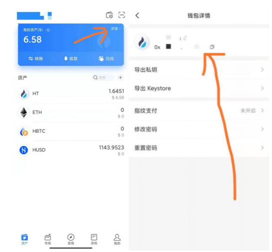
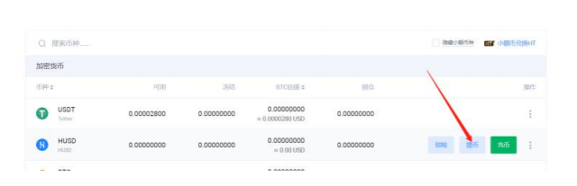
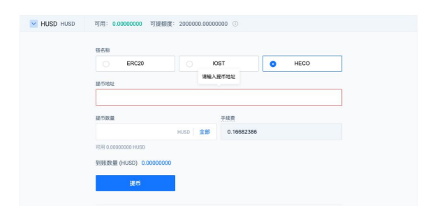

# 🐂 HECO Farming Tutorial

## HECO Introduction 

HECO \(Huobi ECO Chain\) is a decentralized, high-efficiency and energy-saving public chain, also the first product launched by the Huobi Open Platform. It is compatible with smart contracts and supports high-performance transactions. The endogenous token of Heco is HT and it adopts the HPoS consensus mechanism.

## I. Download Wallet or Set Up MetaMask on Browser 

### Option 1: Download Wallet 

Current, the following Wallets supports HECO chain \(click the Wallet name to download\)

[Huobi Wallet](https://www.huobiwallet.com/en) \| [TokenPocket ](https://www.tokenpocket.pro/)\| [BitKeep ](https://bitkeep.org/)\| [MetaMask ](https://metamask.io/)\| [ONTO ](https://www.onto.app/zh)\| [Hyperpay ](https://hyperpay.me/?lang=zh-cn)\|[Dappbirds ](https://dappbirds.com/index)\| [Aolink ](https://aolink.io/#/home)\| [Codebank](https://codebank-m.jinse.com/) \| [Coin98 ](https://coin98.app/)\| [Alphawallet ](https://alphawallet.com/)\| [O3 Wallet](https://o3.network/) \| [Midas ](https://midasprotocol.io/)\| [Onekey](https://onekey.so/en-US)

### Option 2: Set Up MetaMask on Browser 

You can refer to [HECO's guide](https://medium.com/heco-chain/how-to-set-up-matemask-for-heco-chian-53eda451424c) or [ButterSwap's guide](metamask-add-huobi-eco-chain-heco-network.md).

## II. Withdraw Assets to HECO Wallet 

After downloading a wallet, we need to withdraw the assets to the HECO wallet. You can choose to withdraw asset from either [Huobi Global](https://www.huobi.com/en-us/) or a third-party cross-chain swaps.

### Option 1: **Huobi Wallet** 

1. Obtain the HECO wallet address, which can generally be found and copied on the asset details page.

2. We need have a Huobi Global account and certain assets. Select the token to be withdrawn on the asset account page.

3. Enter the HECO wallet address and the amount of token to be withdrawn, and confirm the gas fee _\(the gas fee will be much lower than the withdrawal fee for Ethereum\)._  
**Note: When withdrawing asset, select HECO as the chain name, which is the token standard of Huobi Eco-Chain. Don’t choose any wrong chain, do not fill in the wrong withdrawal address, otherwise it may cause permanent loss of assets.**

4. Confirm the withdrawal, enter the verification code and other information.

5. Check the received information in the HECO wallet.

### Option 2: O3swap \(SWAP Ethereum assets for HECO assets\) 

[**O3swap** ](https://o3swap.com/)**Tutorial:** [https://bit.ly/3v0oOeJ](https://bit.ly/3v0oOeJ)

## III. Where to Participate in HECO Ecological DeFi \(ButterSwap\) 

ButterSwap is a new-concept & leading AMM DEX and yield farming platform audited by CertiK and Knownsec.

Website: [https://butterswap.me](https://butterswap.me)

### Mining on ButterSwap 

Download the decentralized wallet application and create a HECO wallet, please read the above operation process.

* Open the official website in the wallet browser or directly visit [https://butterswap.me](https://butterswap.me)
* Follow the steps [here](https://docs.butterswap.me/beginners-guide/butterswap-tutorial-with-tokenpocket#step-3-connect-wallet) and happy farming!

