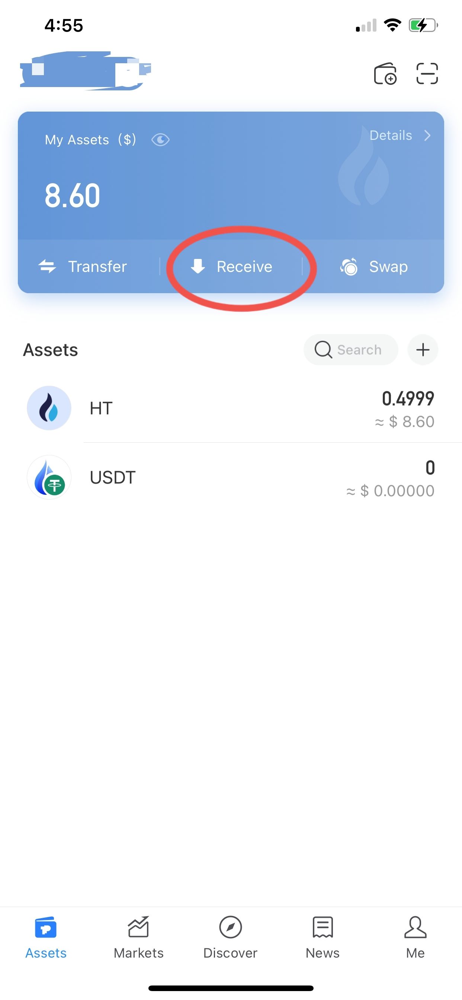
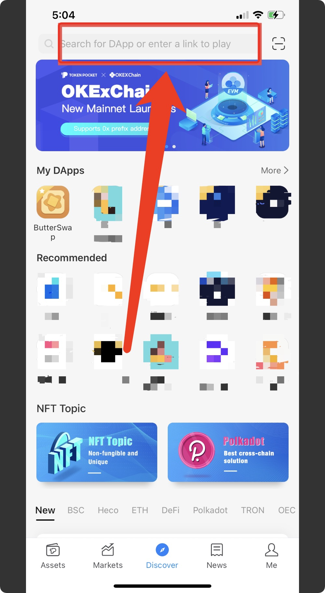
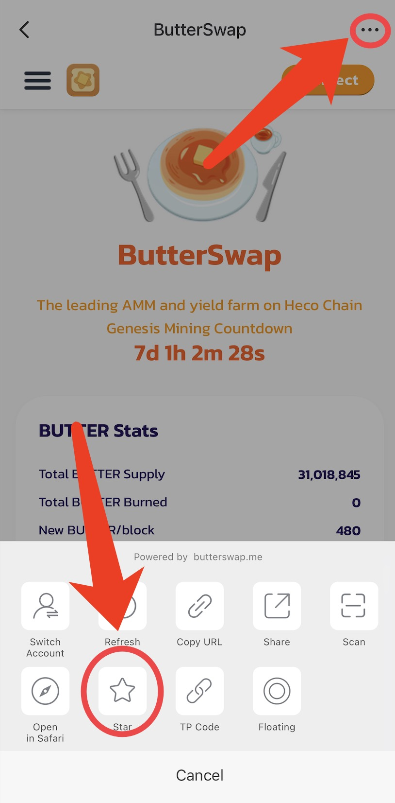
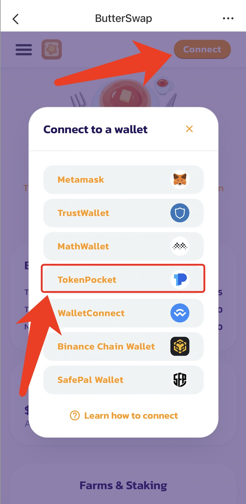
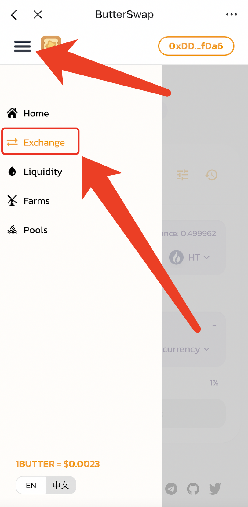
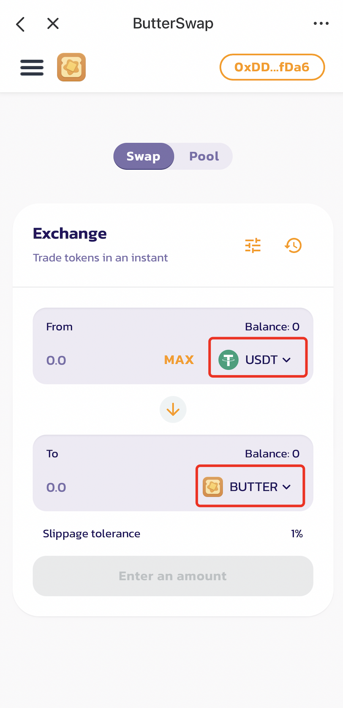
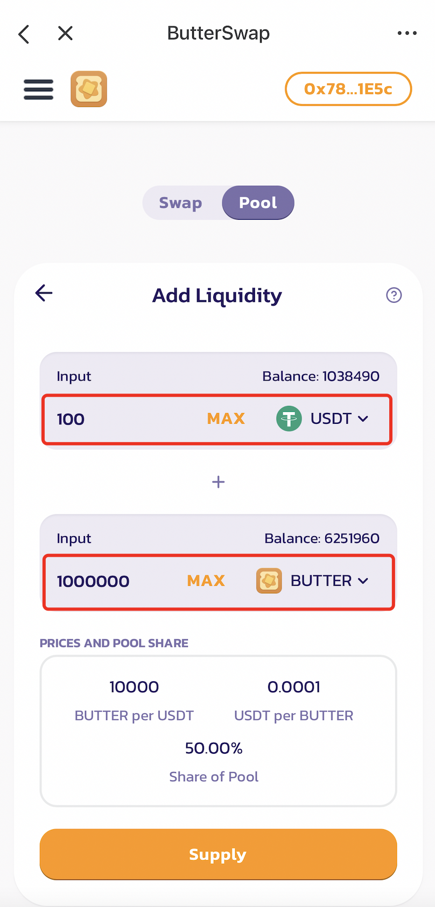

# 💰 How to use ButterSwap?

This guide is a recommended step by step guide for beginners to make the best of ButterSwap. [TokenPocket](https://www.tokenpocket.pro/) is used as an example wallet here for the tutorial. However, other wallets, such as Metamask, Huobi Wallet, etc. are also supported, as long as they support Heco chain.

## Step 1 Create Heco wallet and deposit tokens

Open TokenPocket app, click "Assets" in the bottom left, select "HECO Chain" and click "Add Wallet". Follow the steps to create your own Heco wallet and don't forget to back up your password and mnemonic.

You have to deposit some HT into your wallet for gas fee. And then deposit any other token, such as USDT, HUSD, or BUT for ButterSwap participation.

## Step 2 Open ButterSwap DApp inside wallet

Go to "Discover" and in the top, type in "butterswap.me" and click "Go to DApp".

Click top right corner and click "Star" in the pop up menu, so that you can easily find ButterSwap in "My DApps" section next time.

## Step 3 Connect wallet

Click "Connect" and select the corresponding wallet to connect \(TokenPocket in this guide\).

## Step 4 Swap to get BUTTER

Go to "Exchange" section from the left menu

In the exchange, select from USDT to BUTTER, then you can use the USDT in your wallet to swap BUTTER.

## Step 5 Add to BUTTER/USDT liquidity pool to get LP tokens

In the "Liquidity" section, add BUTTER/USDT pair, or other pairs of tokens, such as BUT/USDT, to get LP tokens.

## Step 6 Stake LP tokens in the farms to earn BUTTER

## Step 7 Stake BUTTER to earn BUTTER and get free CREAM

## Step 8 Stake CREAM in the pools to earn partner tokens

