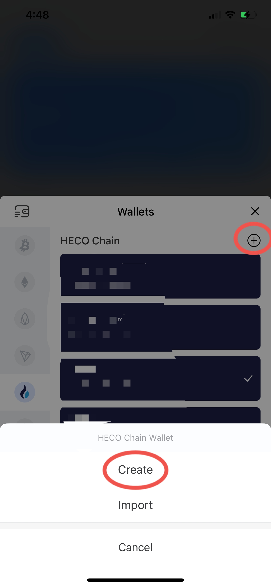

# 💰 How to use ButterSwap?

This guide is a recommended step by step guide for beginners to make the best of ButterSwap. [TokenPocket](https://www.tokenpocket.pro/) is used as an example wallet here for the tutorial. However, other wallets, such as Metamask, Huobi Wallet, etc. are also supported, as long as they support Heco chain.

## Step 1 Create Heco wallet and deposit tokens

Open TokenPocket app, click "Assets" in the bottom left, select "HECO Chain" and click "Add Wallet". Follow the steps to create your own Heco wallet and don't forget to back up your password and mnemonic.

You have to deposit some HT into your wallet for gas fee. And then deposit any other token, such as USDT, HUSD, or BUT for ButterSwap participation.

## Step 2 Open ButterSwap Dapp inside wallet

## Step 3 Connect wallet

## Step 4 Swap to get BUTTER

## Step 5 Add to BUTTER/USDT liquidity pool to get LP tokens

## Step 6 Stake LP tokens in the farms to earn BUTTER

## Step 7 Stake BUTTER to earn BUTTER and get free CREAM

## Step 8 Stake CREAM in the pools to earn partner tokens

