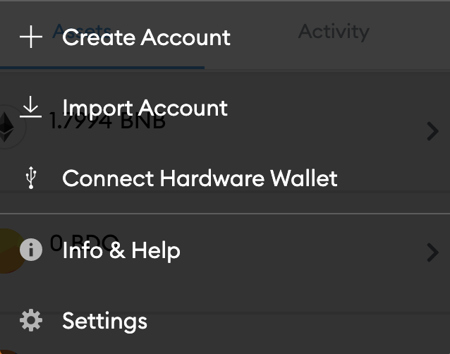
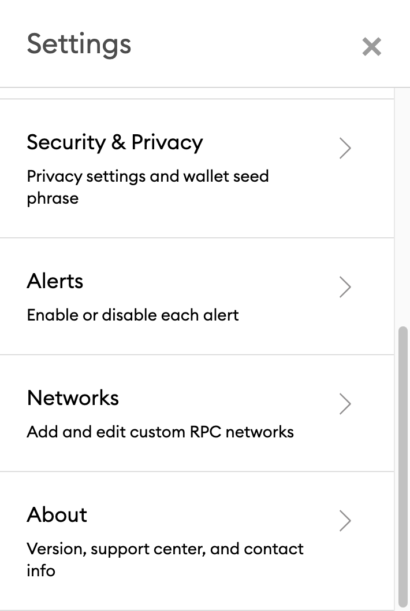
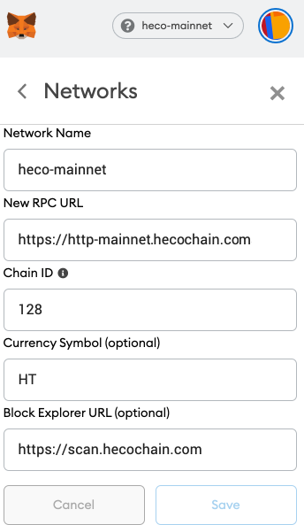

# 🦊 Metamask: Add Huobi ECO Chain \(HECO\) Network

## Connect Your MetaMask With Huobi ECO Chain

1\) Go to the settings page

2\) Click on Networks &gt; Add Network

3\) Key in the relevant details:

* **Mainnet \(use this\)**
  * **RPC** **URL**: [https://http-mainnet.hecochain.com](https://http-mainnet.hecochain.com)
  * **ChainID**: 128
  * **Symbol**: HT
  * **Block Explorer**: [https://scan.hecochain.com](https://scan.hecochain.com)

\*\*\*\*

* **Testnet \(don't use this unless you are a blockchain developer\)**
  * **RPC** **URL**: [https://http-testnet.hecochain.com](https://http-testnet.hecochain.com)
  * **ChainID**: 256
  * **Symbol**: HT
  * **Block Explorer**: [https://testnet.bscscan.com](https://scan-testnet.hecochain.com)

For more information on how to use MetaMask with Huobi ECO Chain \(HECO\), you can check it out [here](https://docs.hecochain.com/#/en-us/wallet).

