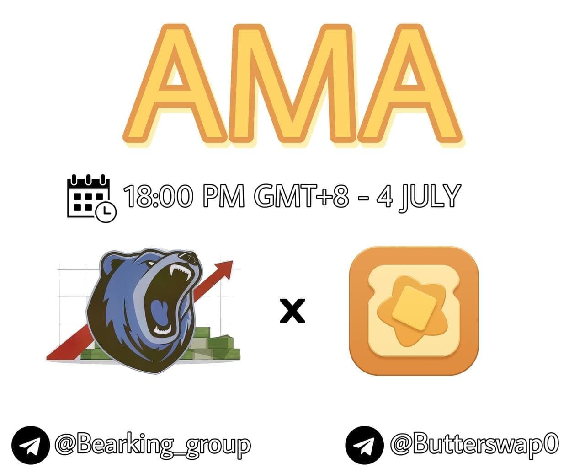

# 🇻🇳 AMA with Bear King \(Vietnam\)

Time: 18:00 PM GMT+8 - July 4, 2021

Telegram: [https://t.me/bearking\_group](https://t.me/bearking_group)

Q1\) Can you please introduce yourself and your background, also introduce the team working on ButterSwap?

Sure. I'm the development lead for ButterSwap. I have a PhD in computer science and I worked in silicon valley California for many years. We are a team of blockchain enthusiasts and we collaborate across multiple counties working on this fantastic DeFi idea. We are true blockchain believers and I bought my first bitcoin in 2014.

Q2\) What is mission of your project? And what users can get from ButterSwap?

In blockchain and smart contracts we believe. Blockchain technology has greatly shaped our world thanks to the great Satoshi Nakamoto. DeFi is also a future trend. We were fascinated by the innovation and creativity of Uniswap. We hope to build a new DEX on top of Uniswap's AMM system and Pancake's yield farming system, and go way beyond that. The ultimate mission for us is to provide the best exchange market for crypto investors of course. The reward system and detailed rules will be fair and encouraging for persistent development of the system. We believe DeFi is still on the rise and we have a long way to go.

ButterSwap users have many benefits. We have fair transaction fee, high yield farming farms, we also have board system for DAO and Lucky Lucky events. There are many more interesting stuff coming out such as NFT blind boxes.

We are pretty early stage projects and we hope to grow together with the community. We read every emails our supporters write to us. We will shape the project so that the users for ButterSwap can maximize their interests and have the greatest joy.

Q3\) Could you explain a little about ButterSwap and what makes it different from other projects?

Our basis can be viewed as Uniswap's AMM + Pancake's yield farming system. We have some innovative board system, that requires holders staking 0.1% of total BUTTER supply to join board, and in board there are many benefits coming out, such as that each day, one lucky board members can receive 1% of a day's total production. We also will have some fantastic new ideas, such as NFT blind boxes for our users to play with.

DeFi projects are like social experiments. We don't know which road is the best road. So we choose to listen to our community. We have voting system and we also check emails. In sum, we are not the decider. The community will decide where ButterSwap will go.

Currently we are only in HECO network because Huobi is a very prestigious exchange and HECO chain's gas fee is very low which is very user friendly. And we plan to provider cross-chain service in the future and unite all crypto investors in different chains.

Q4\) How you tell us about some of the partners project is currently working with ButterSwap?

We have collaborated with Heco chain team both in technical discussions and marketing promotions. They are a very professional team and their marking team is also very strong. They have greatly helped us in the first two weeks of our launch. Also we have partnered with CoinMarketCap to do a fantastic airdrop. 224K users put BUTTER into their watchlists and 168K participants applied for our airdrop. CMC team is very helpful and insightful. They have provided us much help in this airdrop campaign. One interesting fact is that during the launch of our campaign, the total airdrop amount is 30,000 USD, now it worth 81,000 USD. We will still deliver every cent, don't worry 🙂 In the future we will continuously collaborate with HECO and CMC. Also We are very grateful for BEAR KING with today's fantastic AMA with 34K users online. I'm super excited. Thanks:\)

Q5\) How can we use the product & what are the ways to get involved?

Skip.

Q6\) Can you explain how is your Tokenomics Distribution? How many tokens Will be minted ? And How many tokens Will be locked by the team?

Our tokenomics is described here: https://docs.butterswap.me/tokenomics/butter BUTTER is the platform token for ButterSwap and can only be mined in ButterSwap via LP mining \(in Farms\) and BUTTER staking \(in CREAM pools\). For fairness considerations, BUTTER will not be minted before genesis mining, hence all investors get an equal chance of getting BUTTER. The first ever BUTTER was minted on 2021-6-16. BUTTER is minted as block number increases. In the future, reward per block may decrease after halfing. 0.05% of all transaction fee in ButterSwap's exchange will be collected in ButterSwap treasury, which will all be used to buy back BUTTER and burn, and for community growth. You can view the detailed BUTTER burn schedule here https://docs.butterswap.me/tokenomics/butter-burn

Our team does not lock or pre-mint any BUTTER. This is a fair game 🙂

Q7\) how can i get ButterSwap token ? and where can i buy it?

Skip.

Q8\) As we know one thing that investor see from a project and really important is security. How do you convinced user that ButterSwap platform is safe to use?

It is more than 100% safe to use ButterSwap. First, every operation related with your crypto assets is carried out via well-tested and deployed smart contracts. There is no way for anything \(including ButterSwap developer team\) to manipulate your assets. Second, all smart contract source code is available in the GitHub repo. Anyone is welcome to review the source code and compare it with the deployed version on the blockchain. Third, our smart contract source code has been audited independently by the prestigious security company CertiK and KNOWNSEC. Before our launch, they have helped us tested and improved the security mechanisms.

Q9\) Does your project support staking program? if yes. how is your stake system work, what is the need for user if they want to stake in your platform?

Yes, we have staking pools. If you possess BUTTER, you will be able to stake it here https://www.butterswap.me/pools with 687.30% APR. In addition of your staked profits, we will send you free 1:1 CREAM tokens. CREAM tokens can be further used to staked in other CREAM pools. Currently BUT \(listed in Huobi Global\) CREAM pool has APR of 65.96%. If you stake enough BUTTER and get enough CREAM, you can future stake 0.1% of total supply of CREAM to become our board member. You stake CREAM and get BOARD tokens and DAO tokens 1:1 for free. BOARD tokens can be used to stake in many different high APR pools and participate in prize events such as Lucky Lucky. DAO tokens can be used for community voting.

Q10\) What is your top 3 things for priorities in 2021? Could you share some plans for the upcoming year?

That's a good question. Fundamentally, ButterSwap is a DEX and we want to fulfill our basic task - exchange. So our top 1 priority is to provide better swap experiences, with higher liquidity and lower slippage during a swap transaction. We will have various new methods to improve our total liquidity pools. We will also provide swap services for more tokens. Currently we only support around 10 tokens, with many more on the road. Secondly, we will improve our board system, so that more strong supporters will help lock more BUTTER and they get more benefits, which makes the whole eco-system a positive-feedback loop. And last but not least, we will create more mechanisms for BUTTER to be used, such as NFT blind box sales, NFT auction market tax, BUTTER card uses, etc. Our TVL reach 10M USD yesterday for the first time, it is now 11.7M and we hope to make it 100M soon so that the liquidity and user experience can be greatly enhanced. And our ultimate mission is to build a persistent and healthy BUTTER eco-system. To be honest, we don't BUTTER price to grow up too fast, we want to make it a steady curve representing its real underlying value. We hope our BUTTER contains no bubble inside.

\[People ask question 1\] Do you have a strategy for educating non-Crypto users? Please explain to me.

Yes, our ultimate goal is to attract more non-crypto to join our crypto family. We are partnering with some youtube KOLs to record some videos on how to use ButterSwap. We believe the bar will be brought much lower for non-crypto users. And another important method is you guys, you teach your friends and your friends teach more of their friends. This is how BitCoin becomes today's BitCoin right? 🙂

\[People ask question 2\] Vast majority of Crypto projects are built just for the sole purpose of amassing wealth for themselves. So, I want to know the value you aim to add to crypto industry that will bring greater abundance to the industry?

That's a great question! We know that there are many short-term projects that harm users by cheating and faking, etc. These projects are very harmful and they may become wealthy in the short term, but we believe in karma. We will never do such things. I personally learn to program since 2002 and in my 20 years of programming life, I am very strict for every details. We want to add value to the industry instead of doing a short-term project and disappear. We believe DeFi will dominate the market in the next five years and we believe there are still many innovations to be done. We are just excited to be able to be part of it. If you know any developer, you will know that they love code much more than money 🙂

\[People ask question 3\] What made you sure to compete with other projects, what steps did you take to develop your project?

Thanks for your fantastic question. To be honest, we are confident about every line of code we write, but we are not confident about marking and promotion. In fact, many of our early supporters criticize us that why you guys never promote. But we have faith in blockchain and smart contracts, we believe technology will not tell any lies. Crypto exchange is a financial institute that requires precision and safety. We have strong confidence that our background can guarantee that. Other than that, we don't worry about any thing. Even if our TVL drops to 100 USD, we will still continue our journey.

\[People ask question 4\] Can you list 1-2 killer features of this project that makes it ahead of its competitors? What is the competitive advantage your project has that you feel most confident about?

The top killer feature of this project is our team. If you see what we've done in the last two weeks, you will have confidence for us. We are enthusiastic, professional, faithful and strict team. In the meanwhile, we listen to community for innovations. We will build the project better and better along with our community! That aside, our farming APR is also very attractive and the Lucky Lucky are very interesting to participate. Each day 1 supporter wins about 4000 USD \(selected randomly based on algorithms in smart contracts\) and I hope the next one is u 🙂

\[People ask question 5\] Currently most investors only care about profits at the moment but ignore the long-term benefits. So can you give them some advice why they should buy and hold this token/coin in the long term?

That's an excellent question here. This is similar to stock market investment, you buy and sell any time you want \(office hours for stock markets though, not like our crypto markets lol\). Warren Buffett buys stocks from Apple and Coca Cola and hold them for many years and earn some big money. Similarly here. You are more than welcome to buy BUTTER and sell it after 8% increase. \(Actually BUTTER increases around 8% during our AMA\). However, if you believe in our team and believe in our vision, you can buy and hold. Not just holding, but staking of course. Staking BUTTER gives you high APR and being a board member can give you even more projects. In the end, we hope to make ButterSwap a world-famous DEX similar to UniSwap and Pancake. We know that we have a long way to go. Last but not least, crypto investment is risky, don't invest all your money to crypto. After all, supporting family is more important!

